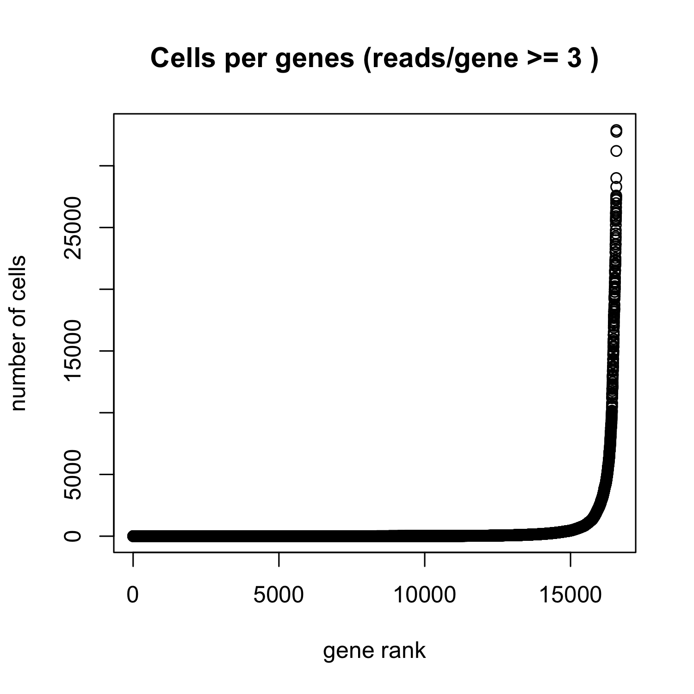
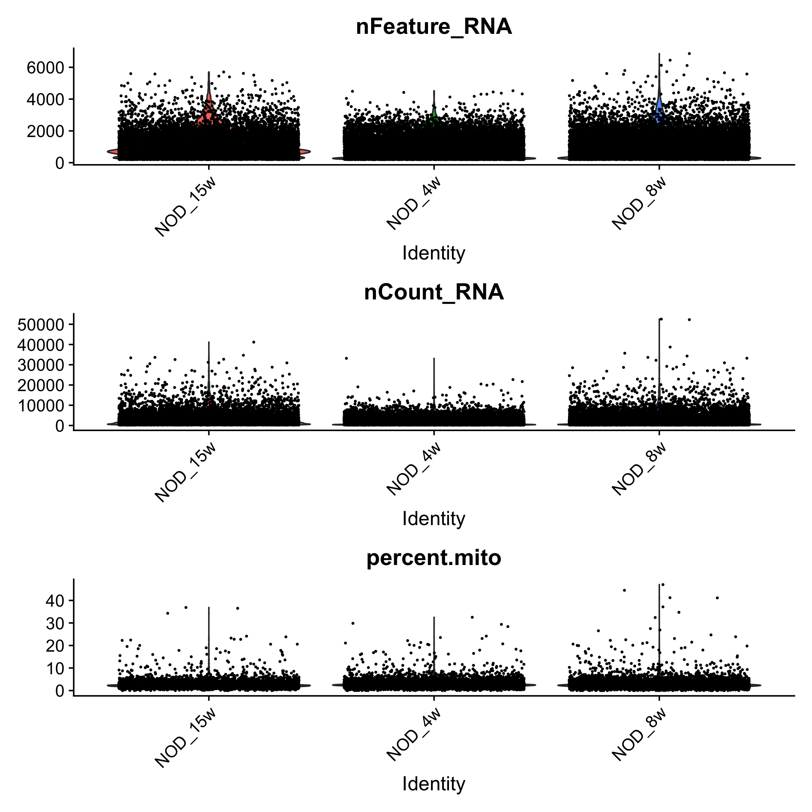
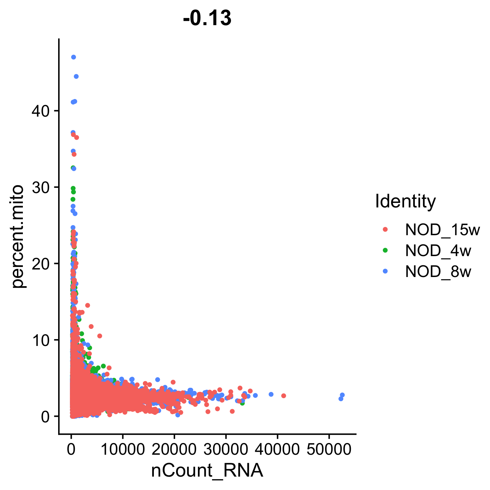

# Reanalysis the scRNA-Seq dataset from GSE141784

[Original analysis and paper can be found here.](https://doi.org/10.1084/jem.20192362)

[Raw data found here.](https://www.ncbi.nlm.nih.gov/geo/query/acc.cgi?acc=GSE141784)

The main goal of the reanalysis is for gaining more practice with single cell RNA-Seq data. 
- Reproduce the results found in the paper.
- Generate some scripts that can be applied to my future dataset.
- Work with different packages.

_________

### Cell-Cycle table:

_________

### Gene rank plot:

_________

### Exploratory violin plots: 

_________

### Cell-Cycle scatter plot:

_________

### RNA scatter plot:

_________

### Top 20 Variable Genes

_________
